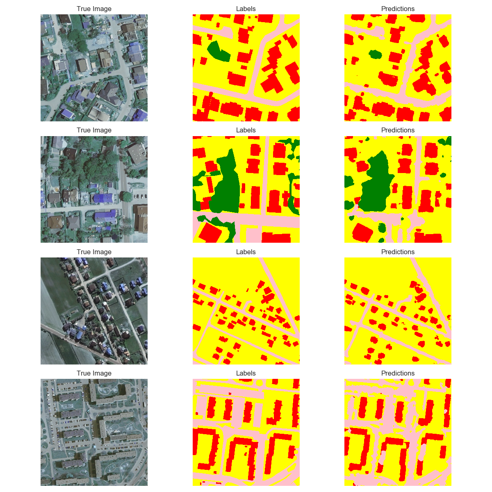

# LandCover.ai Semantic Segmentation

## Overview

The LandCover.ai dataset is designed for automatic mapping of land cover types such as buildings, woodlands, water bodies, and roads from aerial imagery. This dataset contains high-resolution orthophotos with various pixel resolutions and is tailored for semantic segmentation tasks.

## Dataset Features

- **Location:** Poland, Central Europe
- **Spectral Bands:** RGB
- **Orthophotos:**
  - 33 images with a resolution of 25 cm per pixel (~9000x9500 pixels)
  - 8 images with a resolution of 50 cm per pixel (~4200x4700 pixels)
- **Total Area:** 216.27 sq. km

## Dataset Format

- **Rasters:** Three-channel GeoTiffs with EPSG:2180 spatial reference system
- **Masks:** Single-channel GeoTiffs with EPSG:2180 spatial reference system

## Results

The segmentation task was evaluated using the following metrics:

- **Total Accuracy:** 0.9259
- **Mean IoU:** 0.7538

### Class Performance

| Class       | Precision | Recall | F1-Score | Support   |
|-------------|-----------|--------|----------|-----------|
| Background  | 0.95      | 0.93   | 0.94     | 239,926,712 |
| Building    | 0.85      | 0.78   | 0.82     | 3,956,554  |
| Woodland    | 0.90      | 0.95   | 0.92     | 144,170,112 |
| Water       | 0.91      | 0.88   | 0.89     | 24,388,122 |
| Road        | 0.77      | 0.63   | 0.69     | 7,513,188  |

### Class Probabilities

- **Background:** 0.998
- **Building:** 0.992
- **Woodland:** 0.998
- **Water:** 0.997
- **Road:** 0.989

## Visualization

Here are the visualizations related to the project:

- **Dataset Visualization:**
|  |

- **Model Training Visualization:**
|  |

- **Output Visualization:**
|  |

## Model Training

To train the model, use the following command:

python train.py
